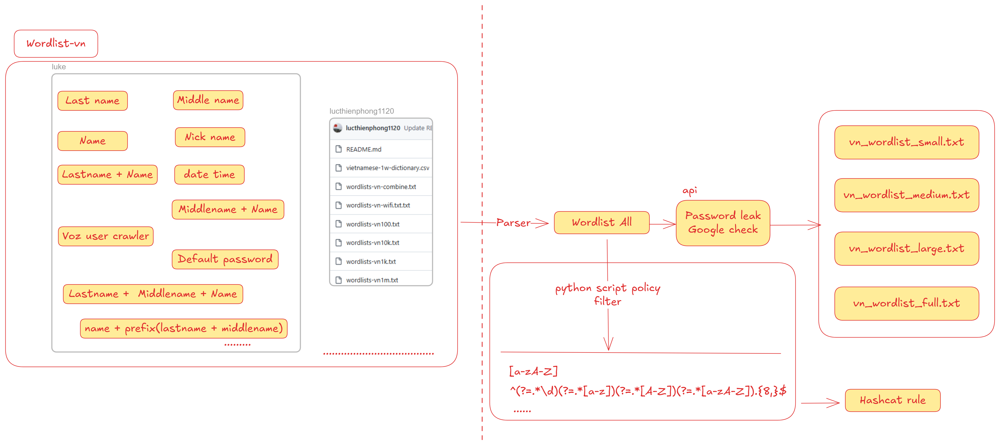

## wordlist-vn

Short Vietnamese‑focused wordlists and hashcat rules for **legal security testing**, **research**


### 📚 Sources
---
- `wordlist/wordlists_vi`  
  Wordlist wifi vietnamese extracted from com.bangdev.wifichua (update 06/02/2021)  
  Most common password entries related to Vietnamese users as seen on public database leaks.  
  Source: https://github.com/lucthienphong1120/wordlists-vi

- `wordlist/vn_lastname.txt` `wordlist/vn_middlename.txt` `wordlist/vn_name.txt` `wordlist/vn_nickname.txt`  
  Manually built from public Vietnamese naming statistics, especially:
  - **100 common Vietnamese family names** – [hoten.org](https://hoten.org/100-ho-pho-bien-nhat/)  
  - **100 common Vietnamese male given names** – [hoten.org](https://hoten.org/100-ten-nam-pho-bien-vietnam/)

- `wordlist/vn_last_middle_name.txt`  
  Create common Vietnamese last name, middle name and name combinations.

- `wordlist/vn_voz.txt`  
  Usernames crawled from **Voz.vn** with id `1-999999` (Vietnamese forum community).

- `wordlist/date_time.txt`  
  Common birth dates (DDMMYYYY format) frequently used in passwords with `01011970-31122026`.

- `wordlist/default_cred.txt`  
  Collection of default credentials (username:password pairs) commonly used by devices, software, and services.  
  Source: https://github.com/ihebski/DefaultCreds-cheat-sheet

### 🔄 Workflows
---

1. **Data collection from sources:**
   - Wordlists from public sources
   - Data from database leaks
   - Usernames from forums/communities (Voz.vn)
   - Common Vietnamese names

2. **Processing and normalization:**
   - Remove unnecessary special characters
   - Normalize encoding (UTF-8)
   - Remove duplicate entries

3. **Integration into wordlist:**
   - Combine wordlists from multiple sources
   - Generate common password variants
   - Filter by pattern matching requirements

### 💻 Usage
---
```
python main.py --help
```
This displays the help menu with all available options.
```
usage: main.py [-h] --mode {date,crawl,combine,filter} [--start-year START_YEAR] [--end-year END_YEAR] [--base-url BASE_URL] [--start-id START_ID] [--end-id END_ID] [--file1 FILE1]
               [--file2 FILE2] [--input-file INPUT_FILE] [--pattern-type {all_four,three_conditions,letter_digit_special,upper_lower_digit,digit_and_letter,default}]
               [--custom-pattern CUSTOM_PATTERN] [--output OUTPUT]

Generate date list, crawl voz usernames, or combine wordlists using command-line arguments.

options:
  -h, --help            show this help message and exit
  --mode {date,crawl,combine,filter}
                        Select 'date' to generate dates, 'crawl' to crawl voz usernames, 'combine' to merge two wordlists, or 'filter' to filter passwords.
  --start-year START_YEAR
                        Start year for date generation (default: 1970).
  --end-year END_YEAR   End year for date generation (default: 2026).
  --base-url BASE_URL   Base URL to crawl (default: https://voz.vn/u/dummy).
  --start-id START_ID   Start user ID to crawl (default: 1).
  --end-id END_ID       End user ID to crawl (inclusive, default: 1000).
  --file1 FILE1         First wordlist file to combine (used when mode='combine').
  --file2 FILE2         Second wordlist file to combine (used when mode='combine').
  --input-file INPUT_FILE
                        Input password file to filter (used when mode='filter').
  --pattern-type {all_four,three_conditions,letter_digit_special,upper_lower_digit,digit_and_letter,default}
                        Pattern type for password filtering (default: 'default'). Options: all_four, three_conditions, letter_digit_special, upper_lower_digit, digit_and_letter, default     
  --custom-pattern CUSTOM_PATTERN
                        Custom regex pattern for password filtering (used when mode='filter'). Overrides --pattern-type.
  --output OUTPUT       Output filename. If not set: date_times.txt for 'date', vozer_crawler.txt for 'crawl', combined.txt for 'combine', filtered_passwords.txt for 'filter'.
```

#### Alternative: Crawling Voz.vn with Feroxbuster
```
.\feroxbuster.exe -u https://voz.vn/u/ -H "User-Agent: Mozilla/5.0 (Windows NT 10.0; Win64; x64) AppleWebKit/537.36 (KHTML, like Gecko) Chrome/142.0.0.0 Safari/537.36" -b "cf_clearance=ycEdGitWnJ4V5_.m5ejlwKQDtoVnC1EkuucOw7ksCbI-1764593420-1.2.1.1-EK1m4zH2dgcB6eCTLkxWrfbX5Fgx5fpz1QgnwzhIWehG.MEd1xib0JSFOS3lQBBwW0_szLthU.1YD3ImDthNqhmcdHZw9Mog4FSYozXlF6GbnaU.uHVquzLtSoHWcD6B1vaSU9y5cpXsVhLzdeRJmccwujYWAITBL9.C.YQXBzyFhRaK5.iObGGpVS0cro2Q_nZiJX.xyNCul6l8QAc.WjUrB2_fFhClhmhJLnCT6bhsRYo.ZyNoe31iIbyoIGAF" --auto-tune --auto-bail -d 0 -t 9 -w voz_1_999999.txt -s 301 -o voz_balance.txt
```
**Note:** Replace the cf_clearance cookie value with your own valid Cloudflare clearance token if needed.

### 🔗 See Also
---
- https://github.com/hnsecurity/kraken  
- https://github.com/lucthienphong1120/wordlists-vi  
- https://github.com/ihebski/DefaultCreds-cheat-sheet  
- https://cookiearena.org/wifi-hacking/tao-wordlist-do-doan-mat-khau-wifi  
- https://blog.techsolvency.com/2025/04/managing-unique-wordlists-password-cracking.html